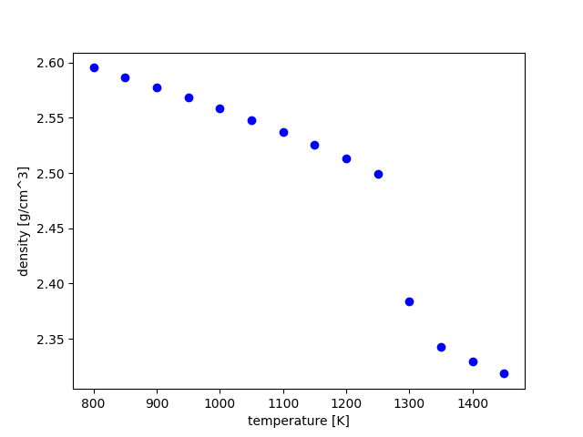
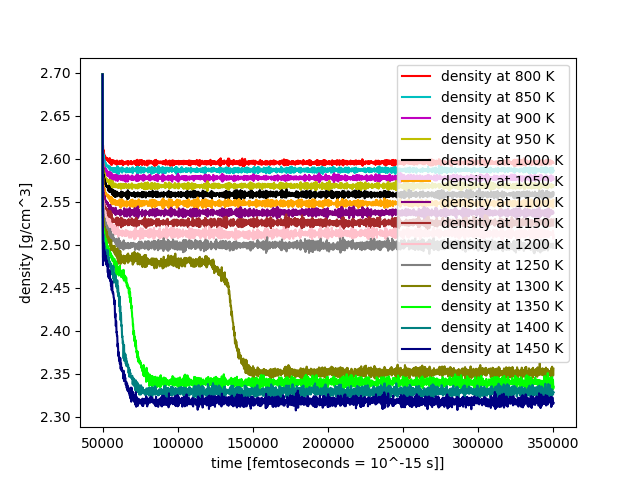

### Code_Joachim ###
# Melting Point Prediction using Discrete Temperature Density Method

This repository contains files and scripts used for predicting the melting points of halides using the CHGNet model and the discrete temperature density method.

## Files in this Repository

- `Internship_report_Joachim_.pdf`: Detailed report of the internship project including methodologies and results.
- `Meltingpoints_discrete_Tr.py`: Python script for running molecular dynamics simulations to predict melting points.
- `README.md`: This file, providing an overview of the repository.
- `discrete_density_temperature.png`: Image showing the discrete density vs temperature plot obtained from the simulations.
- `discrete_density_time.png`: Image showing the discrete density vs time plot obtained from the simulations.
- `get_data.py`: General purpose script used to process and analyze simulation data to generate the aforementioned images.

## Project Description

### Meltingpoints_discrete_Tr.py

This Python script contains the main code for predicting the melting points of halides using CHGNet. The script follows these steps:

1. **Structure Loading**: Load the molecular structure from a CIF file.
2. **Model Loading**: Load the CHGNet model.
3. **Structure Relaxation**: Relax the structure to minimize energy and stress.
4. **Supercell Creation**: Create the largest possible supercell with fewer than 500 atoms.
5. **Molecular Dynamics Simulations**: Run NVT and NPT simulations at discrete temperatures from Tstart to Tend.
6. **Result Analysis**: The results are stored in trajectory and log files for further analysis.

### Generating Images

The `get_data.py` script was used to process the simulation data and generate the images `discrete_density_temperature.png` and `discrete_density_time.png`. These images provide visual insights into the behavior of the system at various temperatures and times, helping to identify the melting point.

### Images

#### Discrete Density vs Temperature

This plot shows how the density of the system changes with temperature. A significant change in density indicates the melting point.

#### Discrete Density vs Time

This plot shows the density of the system over time during the simulations. It helps in understanding the equilibration process and identifying any transitions.

## Conclusion

This repository provides a comprehensive set of tools and data for predicting melting points using the CHGNet model. The scripts and methodologies can be adapted for other similar studies in material science.

For more details, we refer to the `Internship_report_Joachim_.pdf`.

